# Active-Directory-M365-Hybrid-Environment
Enterprise IT Support lab demonstrating Active Directory (AD DS) user lifecycle management, PowerShell automation, and Microsoft 365 / Entra ID hybrid synchronization.

# 🖥️ Enterprise IT Support & Identity Management Lab

## 📋 Executive Summary
In corporate IT Support, the ability to seamlessly manage employee identities, troubleshoot access issues, and administer both local and cloud environments is essential. This lab simulates a modern enterprise IT environment to demonstrate proficiency in **Tier 1 and Tier 2 Help Desk operations**. 

I built a virtualized Windows Server 2022 corporate environment, configured Active Directory Domain Services (AD DS), and automated the onboarding of 1,000+ employees using PowerShell. To replicate a modern workplace, I bridged the local Active Directory to **Microsoft 365 / Entra ID** allowing for centralized management of cloud applications, Single Sign-On (SSO), and robust access security.

## 🎯 Target Help Desk Skills Demonstrated
* **User Lifecycle Management:** Employee onboarding, offboarding, and bulk account provisioning.
* **Active Directory Administration:** Managing Organizational Units (OUs), Security Groups, and utilizing Active Directory Users and Computers (ADUC).
* **Microsoft 365 & Cloud Identity:** Administering Microsoft Entra ID, managing cloud synchronization, and troubleshooting UPN/routing issues.
* **IT Automation:** Writing and executing PowerShell scripts to eliminate manual data entry and reduce time-to-resolution for support tickets.
* **Access & Security Troubleshooting:** Implementing the Principle of Least Privilege and securing user accounts with Conditional Access policies.

## 🛠️ Tools & Technologies Used
* **Virtualization:** Cloud-hosted Windows Server 2022 (AWS EC2)
* **Identity Management:** Active Directory Domain Services (AD DS), Microsoft Entra ID
* **Middleware:** Microsoft Entra Connect Sync
* **Scripting:** Windows PowerShell ISE

---

## 🚀 Step-by-Step IT Support Walkthrough

### Phase 1: Corporate Network Foundation

To create a realistic IT support environment, I deployed a cloud-hosted Windows Server 2022 virtual machine to act as the primary corporate server. 

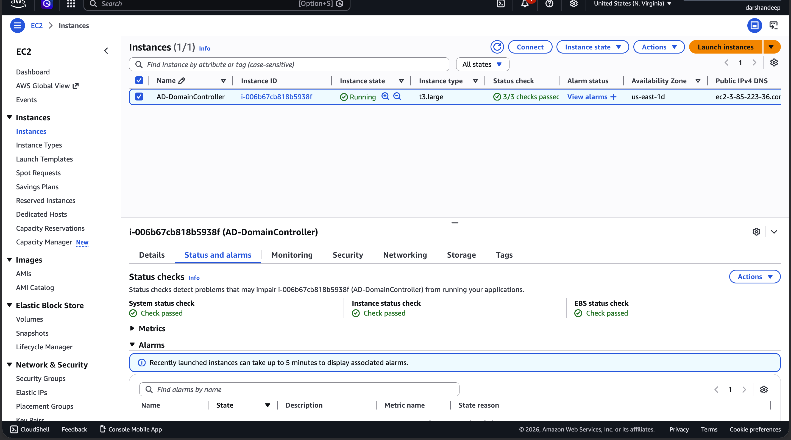

I connected to the server via Remote Desktop (RDP) and utilized Server Manager to install the Active Directory Domain Services (AD DS) role, the backbone of enterprise network management.

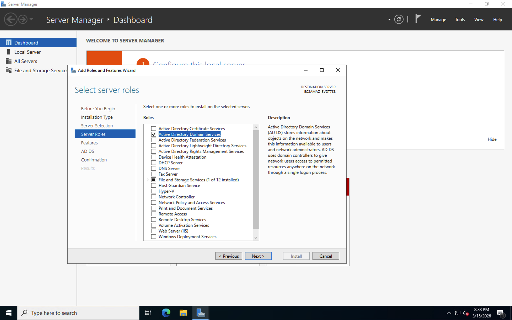

I promoted the server to a Domain Controller, establishing the `DARSHANLAB.com` domain. This provided the central database used to manage all corporate computers, users, and security policies.

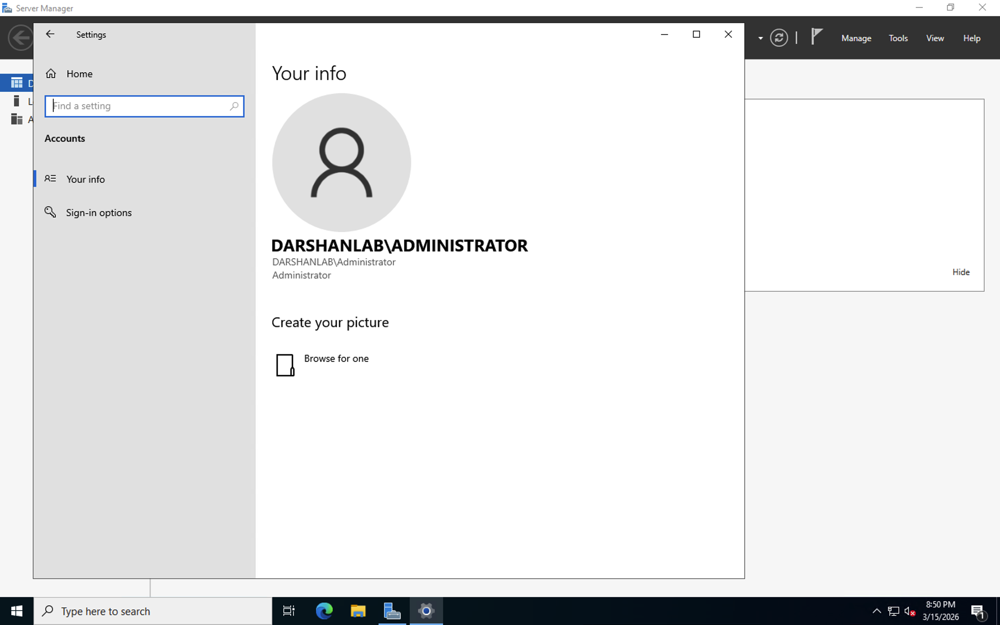

### Phase 2: Employee Onboarding & Active Directory Management

In an enterprise IT environment, security best practices dictate that standard administrative tasks should not be performed using the default Administrator account. I created a dedicated IT Support account (`a-DSingh`) to manage the environment securely.

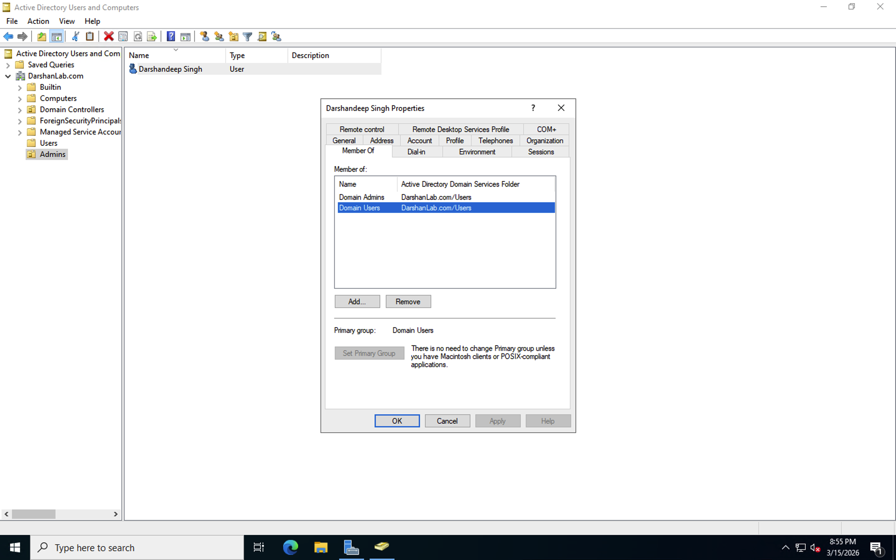

To simulate a large-scale corporate migration or mass onboarding event, I utilized PowerShell to automate the creation of over 1,000 user accounts. I prepared the execution environment by importing a script alongside a raw text file containing employee names.

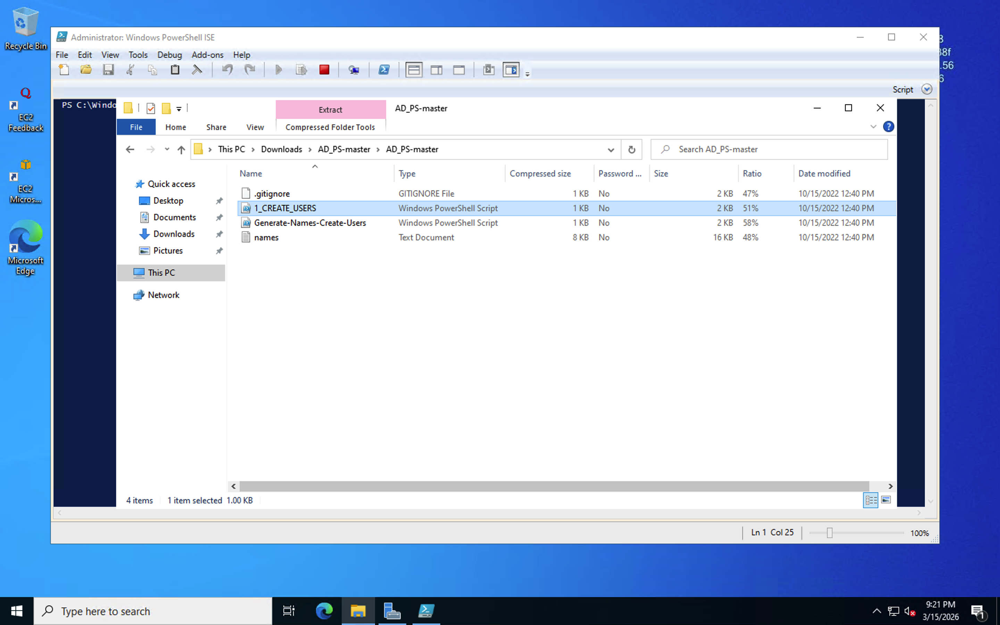

**Automation Logic:** The script parses the text file, formats the usernames according to corporate naming conventions (First Initial + Last Name), assigns a secure temporary password, and places the users into a designated Organizational Unit (OU) for easy management.

    # Snippet of the bulk onboarding logic
    foreach ($n in $USER_FIRST_LAST_LIST) {
        $first = $n.Split(" ")[0].ToLower()
        $last = $n.Split(" ")[1].ToLower()
        $username = "$($first.Substring(0,1))$($last)".ToLower()
        
        New-AdUser -AccountPassword $password -GivenName $first -Surname $last -DisplayName $username -Name $username -Enabled $true
    }

The script successfully generated the identities in seconds, preventing hours of manual data entry. I verified the bulk creation via the Active Directory Users and Computers (ADUC) console.

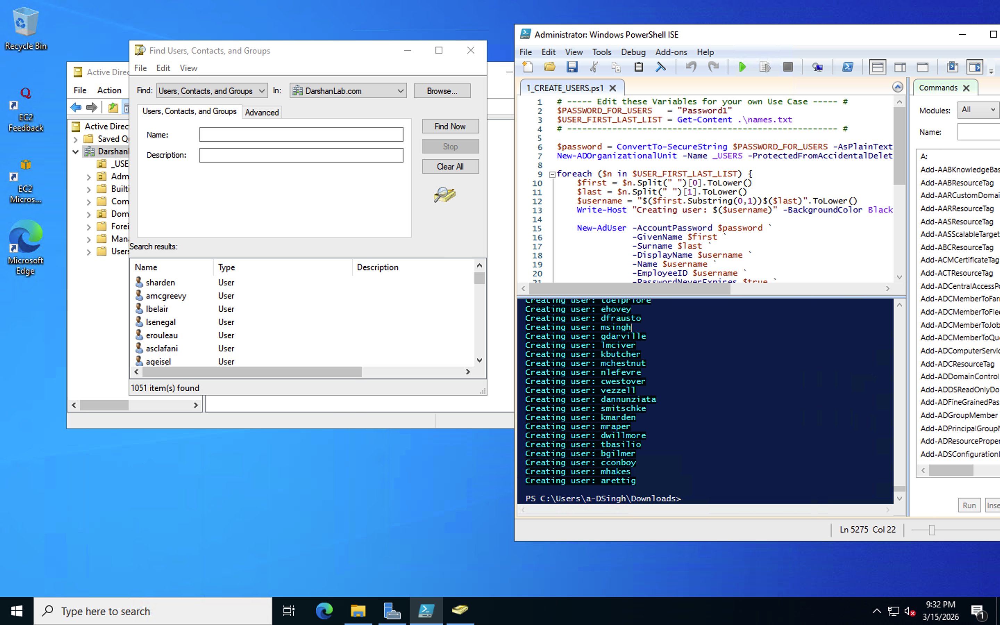

### Phase 3: Microsoft 365 Cloud Integration

Modern Help Desk analysts must support cloud applications (like Teams, Outlook, and SharePoint). I bridged the on-premises Active Directory to a Microsoft Azure/M365 cloud tenant. I first provisioned a dedicated Cloud Global Administrator account (`syncadmin@...`).

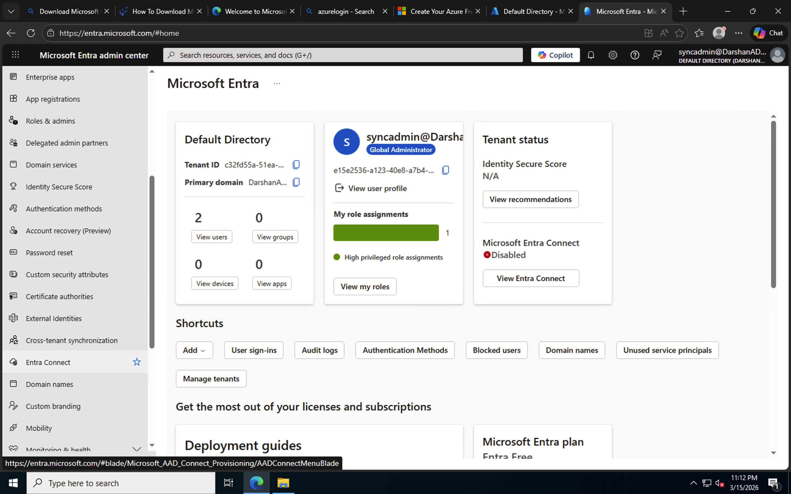

From the Domain Controller, I downloaded and executed the **Microsoft Entra Connect Sync** utility to establish the hybrid connection.

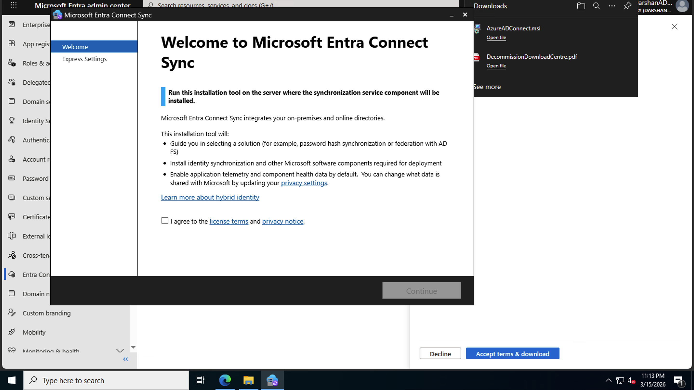

I successfully configured Password Hash Synchronization (PHS). This allows employees to use their standard Windows login credentials to access all Microsoft 365 cloud applications, significantly reducing password reset tickets for the IT Support team.

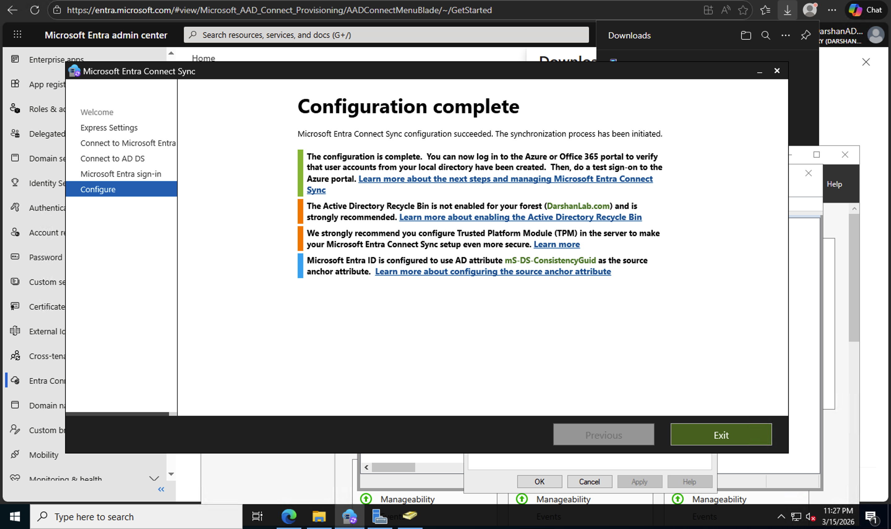

### Phase 4: Validating Employee Cloud Access

To ensure employees could log in successfully, I forced an initial directory synchronization. Moving to the Microsoft Entra ID admin center, I verified that the 1,000+ local users successfully populated the cloud directory.

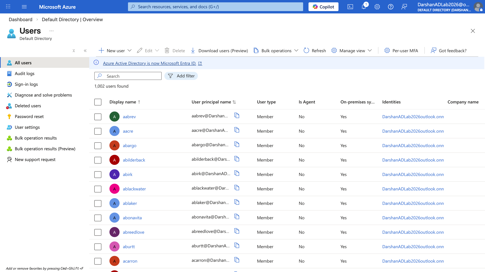

I inspected individual user properties within the cloud portal. The dashboard confirmed that the "On-premises sync enabled" flag was active, meaning IT Support can centrally manage password resets and account lockouts directly from the local Windows Server.

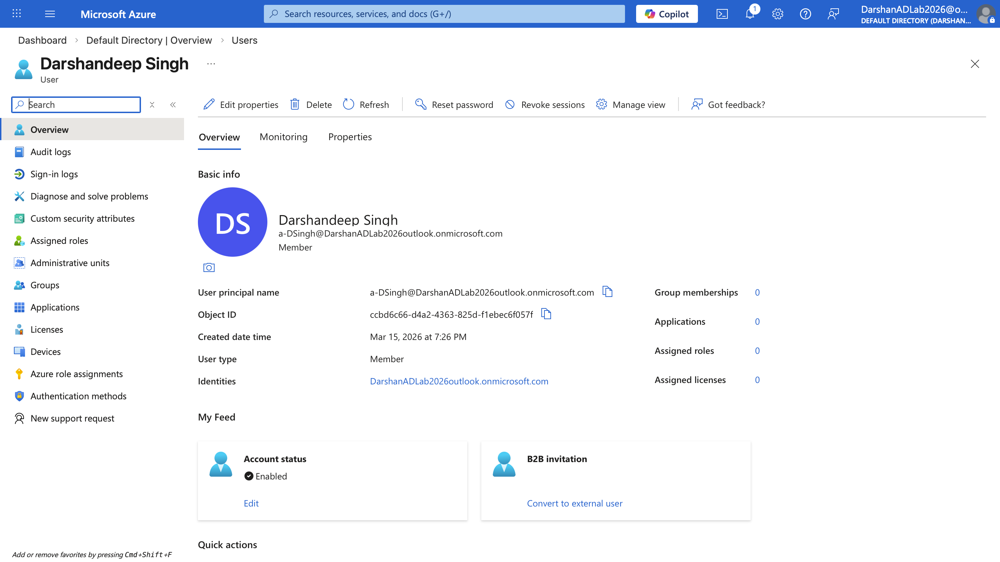

### Phase 5: Account Security & Identity Protection

To protect corporate data from compromised accounts, I implemented perimeter security. I configured **Microsoft Entra Conditional Access** to define Canada as a trusted geographic boundary ("Named Location"). I authored a policy blocking any authentication attempt originating from outside this trusted zone, drastically reducing the risk of unauthorized access.

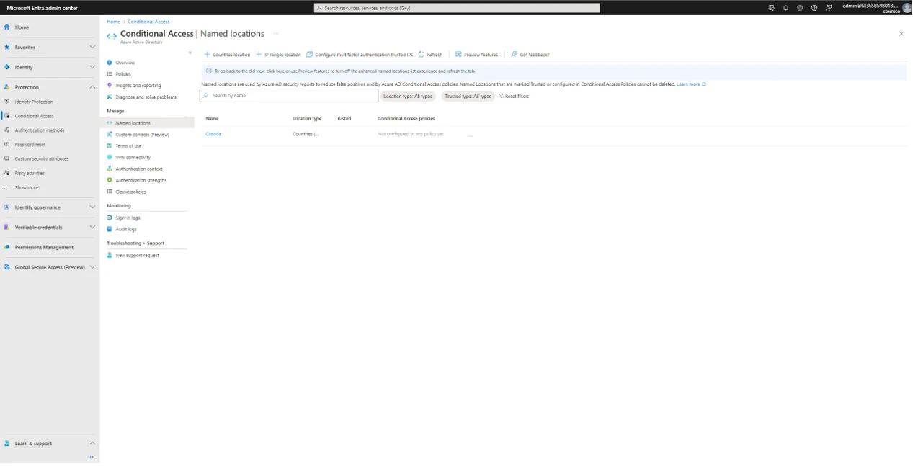

---

## 🛑 IT Support Troubleshooting Scenarios

During this lab, I encountered and resolved several real-world technical issues standard to Tier 2 support escalations:

1. **Privilege Escalation Requirement for Hybrid Sync:**
   * **Issue:** The Microsoft Entra Connect installer threw an error stating the provided local admin account did not have sufficient permissions.
   * **Resolution:** Identified that configuring directory synchronization requires **Enterprise Admin** rights. Temporarily escalated the support account to the Enterprise Admins group, refreshed the Kerberos ticket, and successfully completed the installation. 

2. **UPN Suffix Mismatch in Cloud Routing:**
   * **Issue:** The local domain (`darshanlab.com`) was not a verified custom domain within the Microsoft 365 tenant, leading to a UPN (User Principal Name) routing warning during the sync.
   * **Resolution:** Proceeded with the sync using the default Microsoft tenant routing (`.onmicrosoft.com`). Users successfully synced and were mapped to the fallback cloud domain, maintaining seamless authentication logic.

3. **Strict Cloud Authentication Anti-Fraud Blocks:**
   * **Issue:** Automated Microsoft security algorithms blocked the creation of standard developer tenants due to flagged IPs from repeated lab testing.
   * **Resolution:** Pivoted the architecture strategy by bypassing the standard M365 portal and deploying the identity framework directly through an Azure subscription, successfully bypassing the lock and restoring access.
